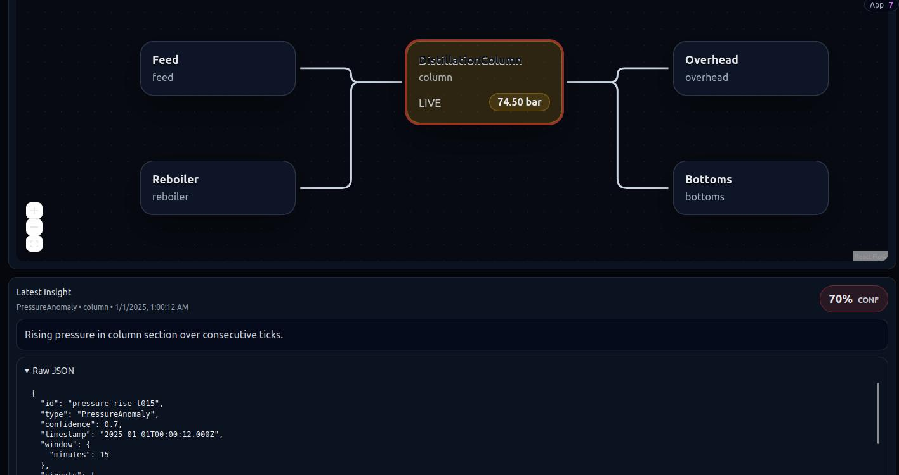

# ⚡ High-Frequency Industrial AI Dashboard



> **A React 18 Proof-of-Concept designed for extreme rendering performance.**
> Visualizing real-time industrial data (SCADA) across hundreds of interactive nodes.

Demo: https://elaborate-cendol-777531.netlify.app/

## 💼 Executive Summary (For Recruiters & Product Owners)

This project demonstrates a **high-performance frontend architecture** capable of handling heavy data streams typical in Industrial IoT, FinTech, or Observability platforms.

The application is engineered to maintain a buttery smooth **60 FPS** frame rate even when processing thousands of signals per second. It successfully overcomes the rendering challenges inherent in complex, real-time data visualizations.

### Key Highlights:
* **Massive Scalability:** Architecture successfully renders **1000s of live nodes**. The demo includes a "Refinery Mesh" simulation with 200 interconnected units and complex signal propagation.
* **Client-Agnostic Design:** The entire UI—including diagrams, charts, and business rules—is dynamically generated from JSON configuration files, allowing for rapid deployment across different industrial sites without code changes.
* **Real-Time Physics:** Visualizes complex alarm propagations (e.g., a "chain reaction" failure passing through pipe networks) instantly and fluidly.

---

## 🚦 Getting Started


1.  **Install dependencies**
    ```bash
    npm install
    ```

2.  **Run the simulation**
    ```bash
    npm run dev
    ```


## 🛠 Technical Deep Dive (For Engineers)

This project moves away from the traditional "Prop Drilling" pattern to an **Atomic State Architecture** to efficiently handle high-frequency updates (5Hz - 10Hz tick rates).

### The Stack
* **Core:** React 18 (Vite)
* **State Manager:** Zustand (External Store pattern)
* **Visualization:** React Flow (@xyflow/react) + Recharts
* **Logic:** Custom deterministic simulation engine

## 🚀 Performance Architecture: How We Achieved 60 FPS

To ensure the main thread remains unblocked during heavy data ingestion\
(200ms ticks across 1000+ nodes), we implemented a specialized **Atomic
State Architecture**.

------------------------------------------------------------------------

### 1️⃣ Atomic State Subscriptions ("Smart Nodes")

Instead of passing data down from a parent component (prop drilling),\
every single Node on the diagram connects directly to the global store.

When a signal changes: - ✅ Only the relevant Node re-renders - ✅ The
parent diagram component renders **0 times**

``` javascript
// src/ui/nodes/SmartUnitNode.jsx
// The node subscribes ONLY to its own specific slice of state.

const { fill, isAlarm } = useRealtimeSelector(
  (state) => selectUnitData(state, id),
  shallowEqualUnitState
);
```

------------------------------------------------------------------------

### 2️⃣ Shallow Equality Checks

We implemented a custom hook `useRealtimeSelector` with rigorous
equality checking.

Even if the data stream pushes a new object reference,\
the UI component skips rendering unless the specific visual properties\
(color, label, alarm status) have actually changed.

``` javascript
// src/ui/nodes/SmartUnitNode.jsx

function shallowEqualUnitState(a, b) {
  if (a === b) return true;

  // React will NOT re-render if visual props are identical
  return (
    a.fill === b.fill &&
    a.isAlarm === b.isAlarm
  );
}
```

------------------------------------------------------------------------


### 3️⃣ Concurrency-Safe Subscriptions (`useSyncExternalStore`)

We consciously avoided using `useEffect` for state synchronization,  
which is prone to tearing and wasted render cycles in high-frequency apps.

By leveraging React 18's `useSyncExternalStore`, we ensure that:

- ✅ The UI remains consistent  
- ✅ No tearing during concurrent rendering  
- ✅ No redundant re-renders  

```javascript
// src/ui/realtime/realtimeStore.js

export function useRealtimeStore(selector) {
  return React.useSyncExternalStore(
    subscribeRealtime,
    () => selector(state), // Get snapshot
    () => selector(state)  // Server snapshot
  );
}

```

------------------------------------------------------------------------

### 4️⃣ Layout Calculation Memoization

Calculating node positions (topology) is expensive  
(O(N²) for certain layout algorithms).

We strictly separate:

- 🧠 **Layout Calculation (Memoized)**  
- ⚡ **Visual Updates (Real-time)**  

Layout is computed **once**, only when the physical diagram structure changes.

High-frequency sensor updates do **not** trigger layout recalculations.

```javascript
// src/ui/ProcessDiagram.jsx

// Layout is computed ONLY when the diagram structure changes,
// ignoring the high-frequency stream of sensor data.

const baseNodes = React.useMemo(() => {
  return computeLayeredLayout({ units, connections });
}, [diagram]);

```